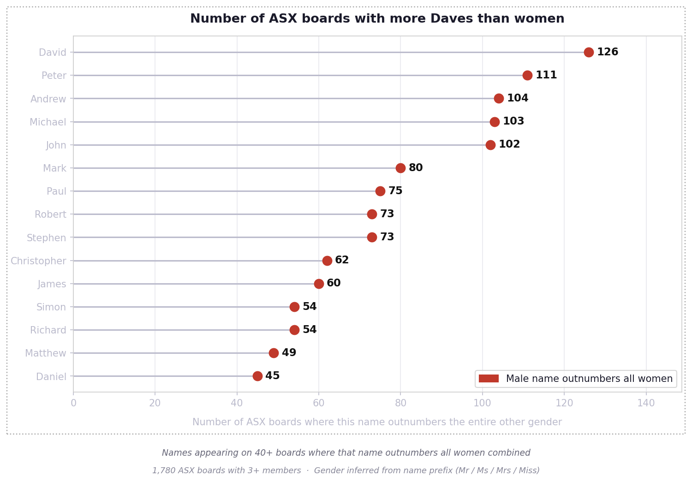
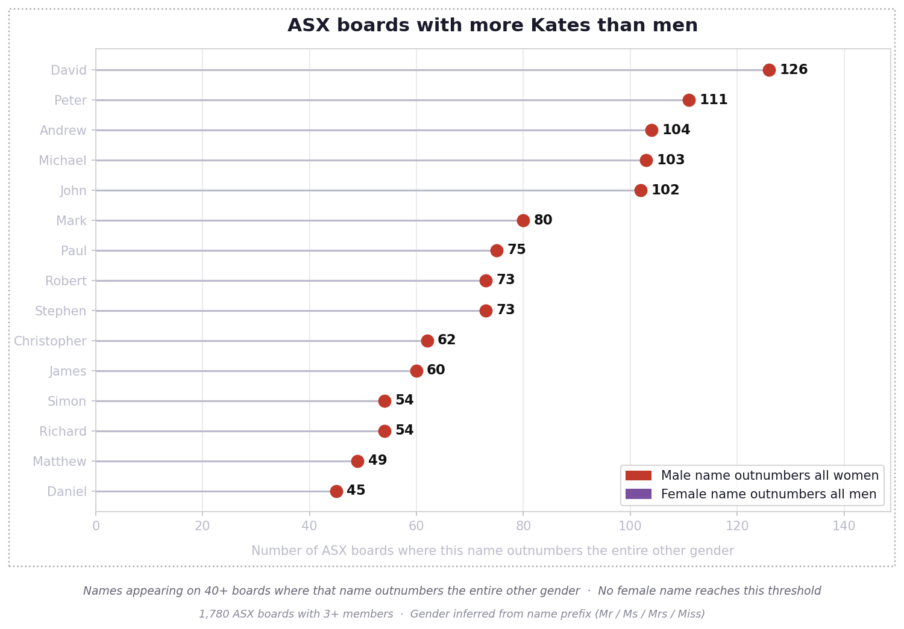

Analysis of ~1,780 ASX companies with boards of 3+ members (March 2026): 77% of board seats are held by men, 18.5% by women, and 50.6% of companies have no women on their board at all.

**Charts**

**1. Number of boards with more Daves than women** — `chart_names_comparison.py` → `data/names_comparison_gender.png`
On 126 ASX boards, there are more directors named David than there are women. Peter, Andrew, John and Michael all follow close behind.


**2. Same chart — with women's names added to the legend** — `chart_names_comparison.py` → `data/names_comparison_gender2.png`
No female name reaches the 40-board threshold. The best any woman's name manages is a single board.


**3. Boardroom table — mostly men / mostly women** — `chart_boardroom.py` → `data/chart_boardroom_two.png`
If 12 seats represented every ASX board: 11 would be held by boards that are mostly men, 1 by boards that are mostly women.


**4. Boardroom table — all men / mostly men / mostly women** — `chart_boardroom.py` → `data/chart_boardroom.png`
Breaking it down further: half of all boards are all-male.


**5. Most common first names on ASX boards** — `chart_top_names.py` → `data/chart_top_names.png`
The top names are overwhelmingly male. The first women's name doesn't appear until rank 42 (Fiona, 32 seats).


**6. Gospel names vs top women's names** — `chart_gospel_women.py` → `data/chart_gospel_women.png`
Each individual gospel name (John=208, Mark=192, Matthew=92, Luke=17) holds more board seats than any single women's name — the top women's name is Fiona with just 32. The four gospel names combined (509 seats) also outnumber the top 10 women's names combined (254 seats).


**Inspiration:** Inspired by [Deb Verhoeven's](https://bsky.app/profile/bestqualitycrab.bsky.social) work on Daversity: [Australian Research: The Daversity Problem](https://debverhoeven.com/australian-research-daversity-problem-analysis-shows-many-men-work-mostly-men/).

**Data:** Board member data is fetched from the MarkitDigital API used by the ASX website (no API key required). Gender is inferred from name prefixes (Mr/Sir/Lord → male; Ms/Mrs/Miss/Dame → female). Titles like Dr or Prof. are classified as unknown (~4%). `data/directors.csv` — one row per board seat: `ticker`, `company`, `raw_name`, `clean_name`, `first_name`, `title`, `gender`, `is_board`.

**Usage:**
```
python3 collect_boards.py        # fetch board data (~20 min)
python3 chart_names_comparison.py
python3 chart_boardroom.py
python3 chart_top_names.py
python3 chart_gospel_women.py
```
Requires Python 3 and `matplotlib`.

**Built by** Anna Syme and [Claude](https://claude.ai) (Anthropic).
