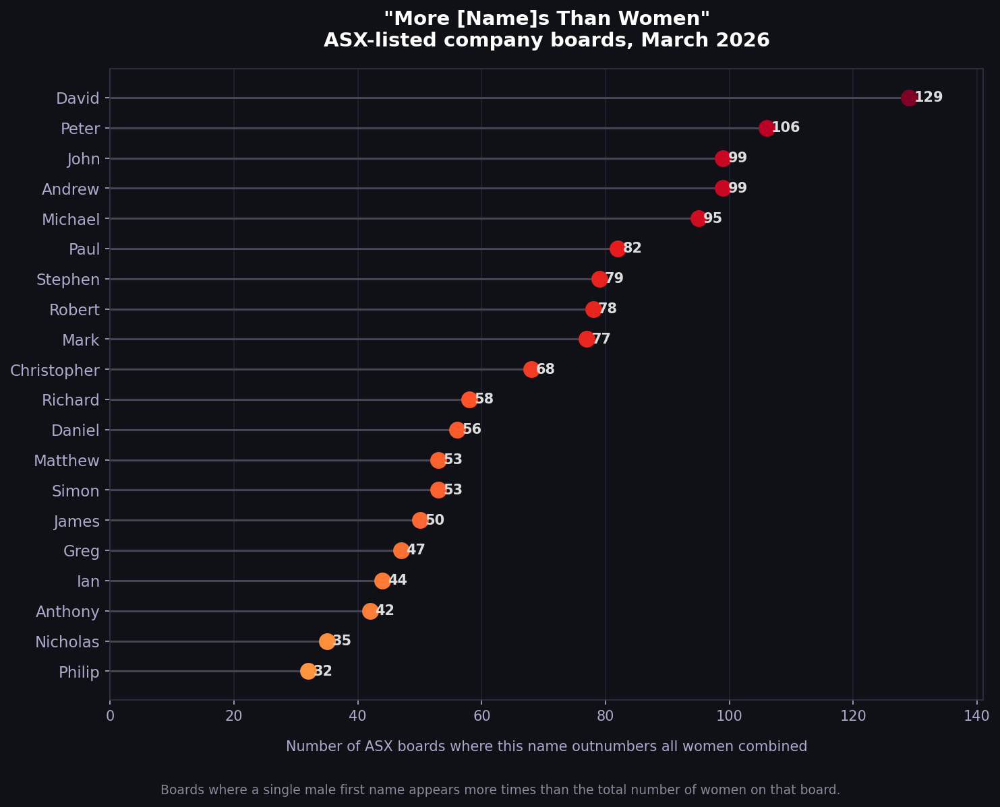
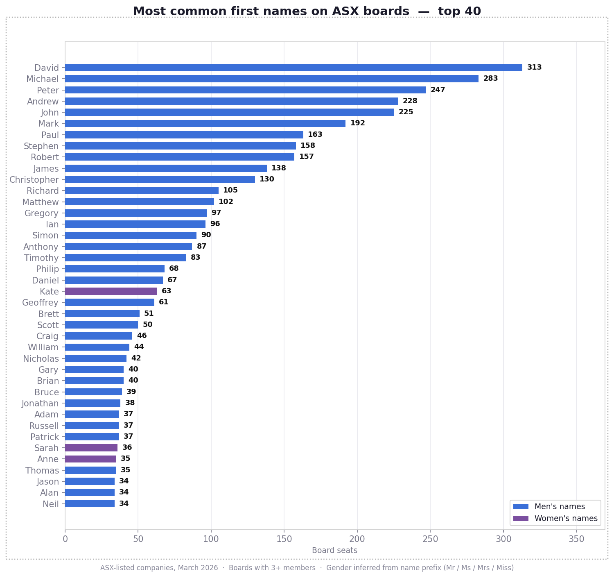
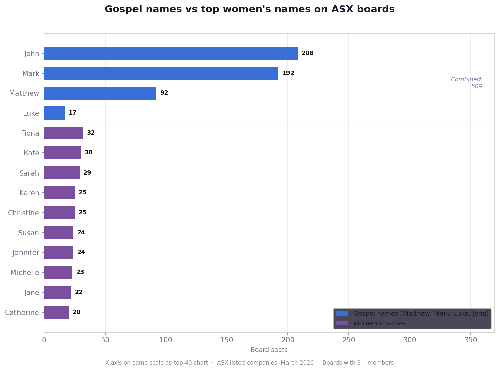
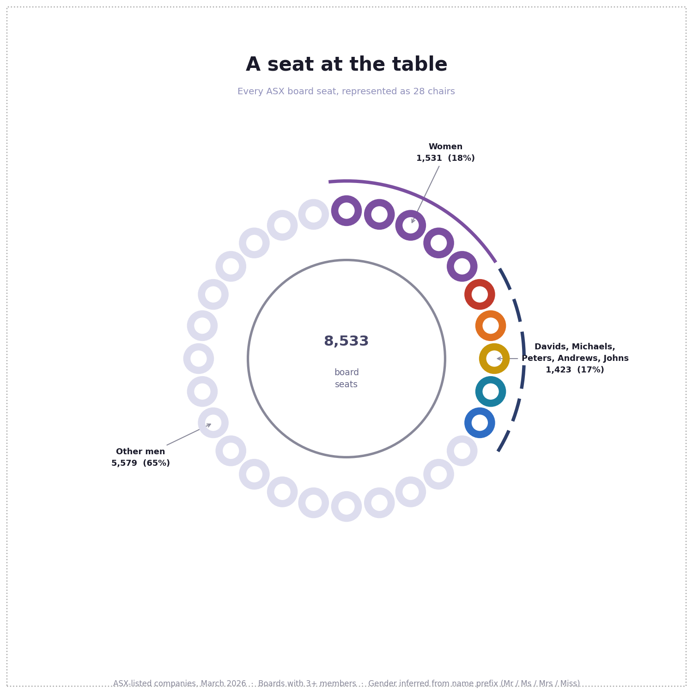
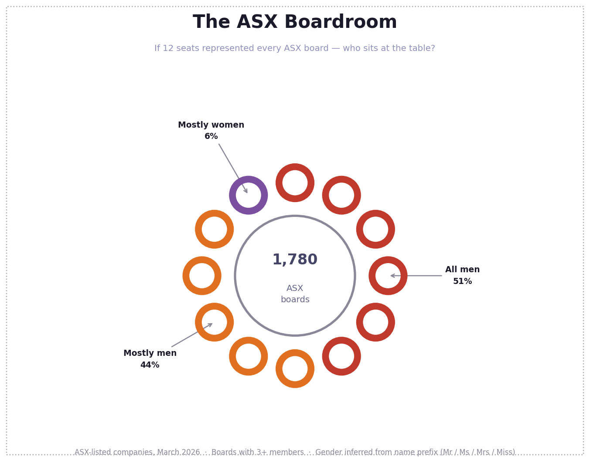
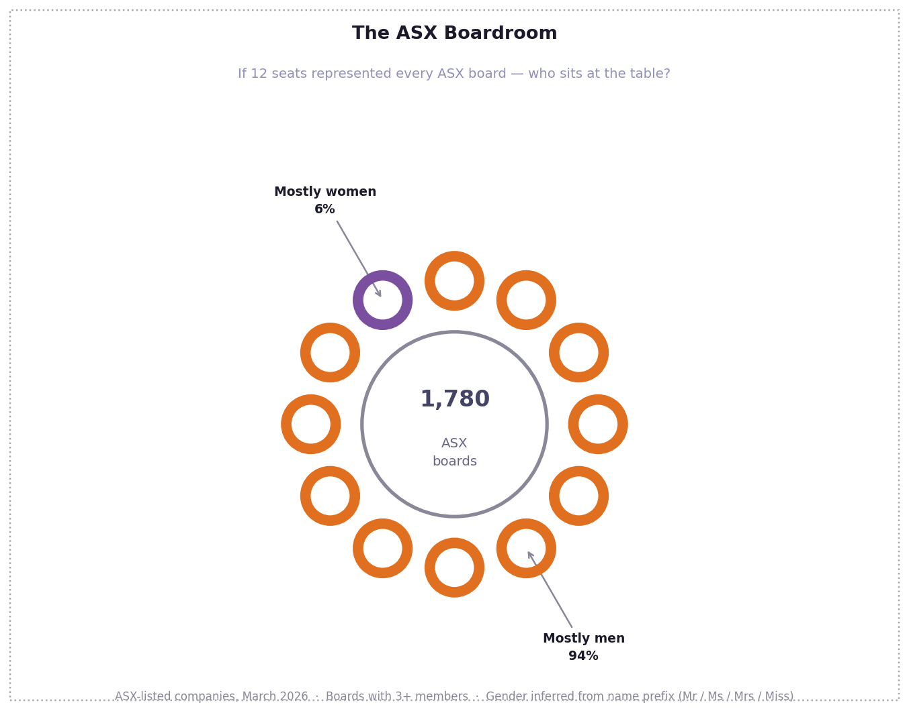
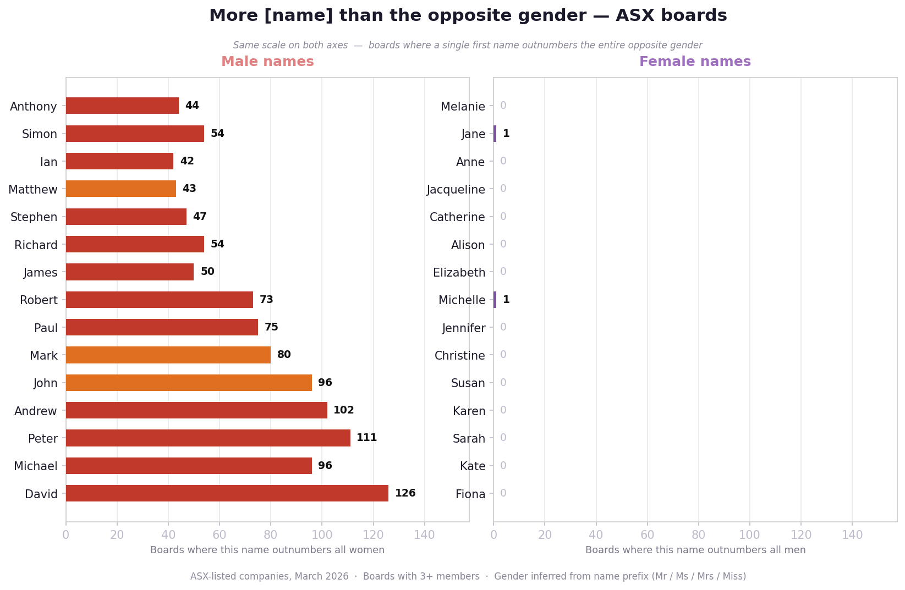

There are more Davids than women on 129 ASX-listed company boards. 

Analysis of ~1,780 ASX companies with boards of 3+ members (March 2026): 77% of board seats are held by men, 18.5% by women, and 50.6% of companies have no women on their board at all.

---

## Charts

### Most common first names on ASX boards
`chart_top_names.py` → `data/chart_top_names.png`

The first women's name doesn't appear until rank 42 (Fiona, 32 seats).



---

### Gospel names vs top women's names
`chart_gospel_women.py` → `data/chart_gospel_women.png`

Matthew, Mark, Luke and John combined (509 seats) vs the top 10 women's names combined (258 seats) — on the same scale.



---

### Boardroom table — named seats
`chart_boardroom_names.py` → `data/chart_boardroom_names.png`

Each circle is a board "chair". Chairs are coloured by named groups of men (Davids, Michaels, Peters…) alongside the single chair for women.



---

### Boardroom table — all men / mostly men / mostly women
`chart_boardroom.py` → `data/chart_boardroom.png`



---

### Boardroom table — mostly men / mostly women
`chart_boardroom.py` → `data/chart_boardroom_two.png`



---

### More [name] than the opposite gender
`chart_name_symmetry.py` → `data/chart_name_symmetry.png`

Boards where a single male (or female) first name outnumbers the entire opposite gender. The x-axis is the same scale for both panels.




---

## Inspiration

Inspired by [Deb Verhoeven's](https://bsky.app/profile/bestqualitycrab.bsky.social) work on Daversity [Australian Research: The Daversity Problem](https://debverhoeven.com/australian-research-daversity-problem-analysis-shows-many-men-work-mostly-men/).

---

## Data

Board member data is fetched from the MarkitDigital API used by the ASX website — no API key required:
- Company list: `https://www.asx.com.au/asx/research/ASXListedCompanies.csv`
- Board data: `https://asx.api.markitdigital.com/asx-research/1.0/companies/{ticker}/about`

Gender is inferred from name prefixes (Mr/Sir/Lord → male; Ms/Mrs/Miss/Dame → female). Titles like Dr or Prof. are classified as unknown (~4%).

`data/directors.csv` — one row per board seat. Fields: `ticker`, `company`, `raw_name`, `clean_name`, `first_name`, `title`, `gender`, `is_board`.

---

## Usage

```bash
# 1. Collect board data for all ~1,978 ASX companies (~20 min)
python3 collect_boards.py

# 2. Generate charts
python3 chart_top_names.py
python3 chart_gospel_women.py
python3 chart_boardroom.py
python3 chart_boardroom_names.py
python3 chart_name_symmetry.py
```

Requires Python 3 and `matplotlib` (`pip install matplotlib`).

---

## Built by

Anna Syme and [Claude](https://claude.ai) (Anthropic).
